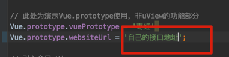
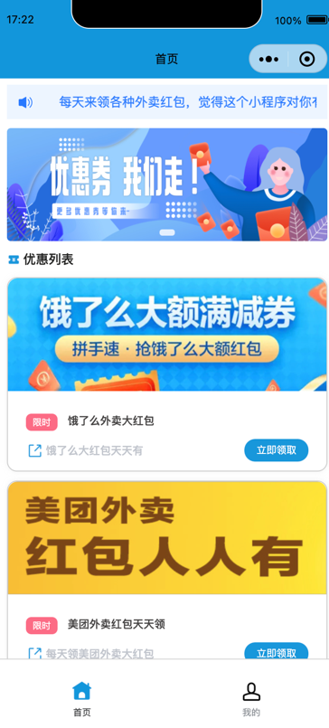
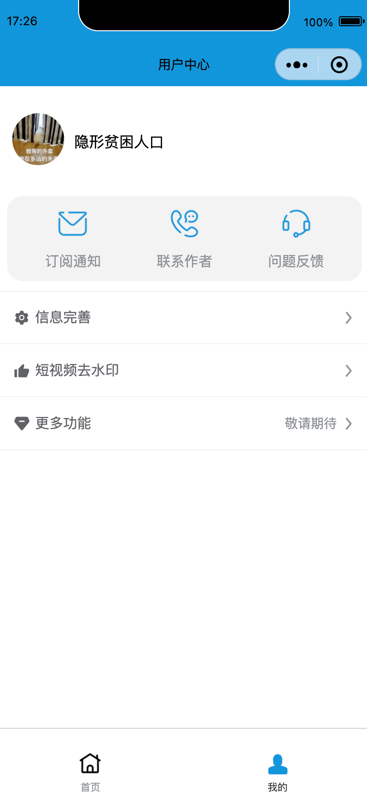

**爱券码小程序端**

**使用方式**  
1.composer install  
2.修改main.js   

<a href="https://github.com/hulixin695920/chwl">[后台源码地址] </a>

**程序截图**

**原理**  
淘宝联盟和美团联盟（美团联盟咱只对企业开放）允许用户进行推广，推广后可以拿到佣金。
本程序，通过抓包，获取自己的专属链接。然后通过小程序跳转进行领取大额红包。用户使用红包后，
用户可以拿到相应佣金。本人想做个佣金返现的功能，奈何链路太长，无法获取下单的人。有啥想法，欢迎联系我。

**个人中心**

